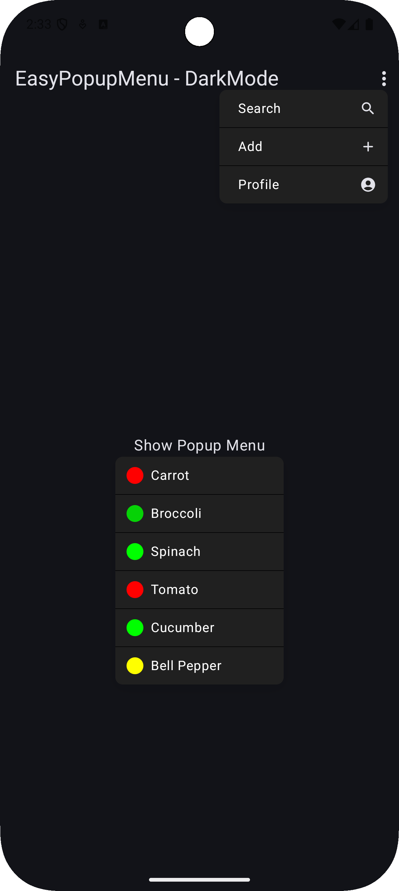
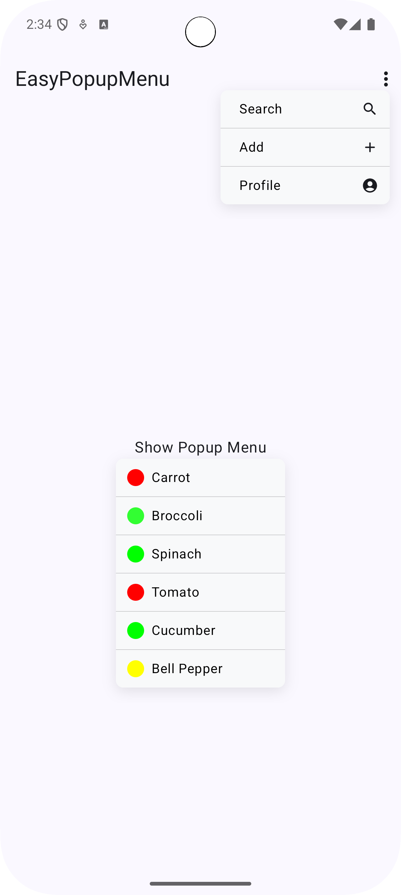

# EasyPopupMenu - Jetpack Compose

A customizable, animated and easy-to-use popup menu component for Jetpack Compose.

<p align="center">
  
  
</p>

## Features

- 🎨 Fully customizable theming support 
- ✨ Smooth open/close animations
- 📱 Automatic positioning
- 🌓 Light/Dark theme support
- 🎯 Icons and separators support
- 📏 Customizable dimensions

## Installation

Add JitPack repository to your build file:

```groovy
// settings.gradle.kts
dependencyResolutionManagement {
    repositories {
        maven { url = uri("https://jitpack.io") }
    }
}
```
```groovy
// app/build.gradle.kts
dependencies {
    implementation("com.github.ahmet-ozberk:easypopupmenu:1.0.0")
}
````

## Basic Usage

```kotlin
val state = rememberEasyPopupState()

EasyPopupMenu(
    state = state,
    items = listOf(
        EasyPopupMenuItem(
            text = "Option 1",
            onClick = { state.isVisible = false }
        ),
        EasyPopupMenuItem(
            text = "Option 2",
            onClick = { state.isVisible = false }
        )
    )
) {
    Text("Open Menu")
}
```

## Customization
### Using Custom Theme

> Note: If you write theme properties in EasyPopupMenuItem, the global theme properties for that EasyPopupMenuItem will be disabled.

```kotlin
val customTheme = EasyPopupMenuTheme(
    backgroundColor = Color.DarkGray,
    textColor = Color.White,
    cardCornerRadius = 16.dp,
    separator = Separator(
        color = Color.Gray,
        thickness = 1.dp
    )
)

EasyPopupMenu(
    state = state,
    theme = customTheme,
    items = listOf(/* ... */)
) {
    // Content
}
```

### Using İcons
```kotlin
EasyPopupMenuItem(
    text = "Search",
    leading = {
        Icon(
            Icons.Rounded.Search,
            contentDescription = null,
            modifier = Modifier.size(18.dp)
        )
    },
    onClick = { /* ... */ }
)
```


## Theme Properties

| Property | Description | Default Value |
|----------|-------------|---------------|
| minWidth | Minimum width | 180.dp |
| maxWidth | Maximum width | 256.dp |
| minHeight | Minimum height | 32.dp |
| cardCornerRadius | Corner radius | 8.dp |
| backgroundColor | Background color | Color(0xFFF8F9FA) |
| textColor | Text color | Color(0xFF000000) |
| textSize | Text size | 14.sp |
| fontWeight | Font weight | FontWeight.Normal |
| separator | Separator style | Separator() |
| cardElevation | Shadow elevation | 12f |
| elevationAlpha | Shadow opacity | 0.1f |
| dampingRatio | Animation damping ratio | 0.75f |
| stiffness | Animation stiffness | 400f |

## MenuItem Properties

| Property | Description |
|----------|-------------|
| text | Menu item text |
| leading | Leading icon |
| trailing | Trailing icon |
| onClick | Click action |
| backgroundColor | Item background color |
| textColor | Item text color |
| separator | Item specific separator |

## Contributing

Feel free to open issues and submit pull requests.